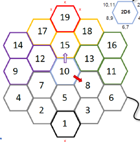
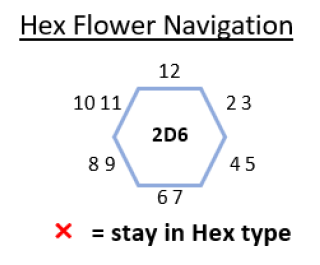

# Hex Movement Simulator

The Nex Flower Movement Simulator is used to simulate X number of turns of player
movement throughout a hex grid. The simulator uses a config file to determine the
starting position, number of turns to simulate, and the blockers and teleporters. The
script then outputs the number of times the player landed on each tile, as well as
the entire path of the player.

# Requirements

- Node.js (https://nodejs.org/en/)

# Installation

Download the repository to your computer. This can be done by clicking the green
Code button and selecting Download ZIP.

Once downloaded and extracted, open a terminal in the folder. Then run
the following command:

```sh
npm install
npm run build
```

# Usage

Browse to the project folder, then run the below command.

> Note: The config file must be located in the `configs` folder. However, you do not
> need to specify the full path to the config file. The script will automatically
> look in the `configs` folder.

```sh
npm start --config config_file.json
```

Two files are created in the `results` folder, one for a summary of the tile results, and the other for the entire path of the player.
The files are prepended with the name of the `config_file.json` from the script running

# Creating a config file

A config file is a JSON file that contains information necessary for the simulation.

## Config File Structure

```json
{
  "starting_position": 1,
  "turns_to_simulate": 10000,
  "blockers": [],
  "teleporters": []
}
```

## Sample Config File

```json
{
  "starting_position": 1,
  "turns_to_simulate": 10000,
  "blockers": [
    { "tile": 19, "edge": 12 },
    { "tile": 11, "edge": 4 },
    { "tile": 4, "edge": 9 },
    { "tile": 14, "edge": 11 }
  ],
  "teleporters": [
    { "tile": 9, "edge": 8, "target": 18 },
    { "tile": 2, "edge": 6, "target": 14 }
  ]
}
```

## Tile numbering

Tiles are numbered from 1 to 19, starting at the top center.



## Edge numbering

Edges are numbered from 1 to 12, starting at the top edge and moving clockwise.
The edges are numbered based on the hex flower navigation rules. In most cases, the same
edge can be denoted by two numbers. For example, Edge 2 and Edge 3 are both for the top-left
edge of a tile.



## Config File Properties

### starting_position

The starting position (tile) of the player. This is a number between 1 and 19.

### turns_to_simulate

The number of times the dice should roll and the player should move.

### blockers

An array of objects showcasing which edges of a tile the player cannot pass through

### teleporters

An array of objects that represent teleporters. Teleporters are edges of a tile
that teleport the player to another tile.

# Options

## --config

The path to the config file. This is a required option.
Config file must be located in the `configs` folder.
